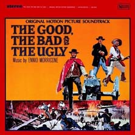
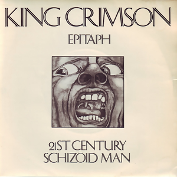
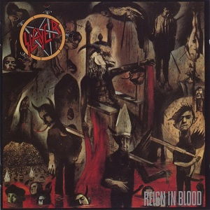

24 Greatest Songs of All Time
=============================

 

Release dates denote when the song was first published, either as a single
or as a part of an album. Image shows the cover of the single or the label if no
edition of the single had a cover. If song was never released as a single,
then the cover of the first album that featured the song is used. Songs with
multiple versions have the preferred version listed first in the <i>lengths</i>
field.
 
 
<b>Click on the cover to listen to the song on YouTube!!!</b> 
<b>YouTube <a target="_blank" href="https://www.youtube.com/watch?v=SDtVAM80zbg&index=1&list=PLaeyhQtn9sJyEbOQ9Ouo9e8VdMBgA7nt1">
playlist</a> is also available.</b>
  

### '54 Oct | "Mr. Sandman" — The Chordettes  

**Genres:&ensp;Barbershop Music, Traditional Pop**  
**Writer:&ensp;Pat Ballard**  
**Producer:&ensp;Archie Bleyer**  
**Length:&ensp;2:22**  
**Label:&ensp;Cadence**  

### '55 Dec | "Folsom Prison Blues" — Johnny Cash  

**Genres:&ensp;Rockabilly, Rock And Roll**  
**Writer:&ensp;Johnny Cash**  
**Producer:&ensp;Sam Phillips**  
**Length:&ensp;2:50**  
**Label:&ensp;Sun**  

### '66 Dec | "The Ecstasy of Gold" — Ennio Morricone  

**Genres:&ensp;Film Score, Western**  
**Writer:&ensp;Ennio Morricone**  
**Producer:&ensp;Ennio Morricone**  
**Length:&ensp;3:22**  
**Labels:&ensp;Emi America, Capitol Records**  

### '67 Dec | "If 6 Was 9" — the Jimi Hendrix Experience  

**Genre:&ensp;Rock**  
**Writer:&ensp;Jimi Hendrix**  
**Producer:&ensp;Chas Chandler**  
**Length:&ensp;5:32**  
**Labels:&ensp;Track (Uk), Reprise (Us)**  

### '69 Oct | "21st Century Schizoid Man" — King Crimson  

**Genres:&ensp;Progressive Rock, Jazz-Rock, Heavy Metal, Progressive Metal**  
**Writers:&ensp;Robert Fripp, Michael Giles, Greg Lake, Ian Mcdonald, Peter Sinfield**  
**Producer:&ensp;King Crimson**  
**Length:&ensp;6:45 (Live in Mexico City, '96 / '99), 7:20 (Album Version)**  
**Label:&ensp;Island**  

### '71 Apr | "L.A. Woman" — the Doors  

**Genres:&ensp;Rock And Roll, Blues Rock**  
**Writer:&ensp;Jim Morrison**  
**Producers:&ensp;The Doors, Bruce Botnick**  
**Length:&ensp;7:49 (original version), 7:59 (40th anniversary edit)**  
**Label:&ensp;Elektra**  

### '72 Nov | "Walk on the Wild Side" — Lou Reed  

**Writer:&ensp;Lou Reed**  
**Producers:&ensp;David Bowie, Mick Ronson**  
**Length:&ensp;4:12**  
**Label:&ensp;Rca Records**  
   

### '75 Oct | "Bohemian Rhapsody" — Queen  

**Genres:&ensp;Progressive Rock, Hard Rock, Progressive Pop**  
**Writer:&ensp;Freddie Mercury**  
**Producers:&ensp;Roy Thomas Baker, Queen**  
**Length:&ensp;5:55**  
**Labels:&ensp;Emi (Uk), Elektra (Us)**  

### '76 Feb | "Blitzkrieg Bop" — Ramones  

**Genre:&ensp;Punk Rock**  
**Writers:&ensp;Tommy Ramone, Dee Dee Ramone**  
**Producer:&ensp;Craig Leon**  
**Length:&ensp;2:12**  
**Label:&ensp;Sire/Abc**  

### '77 Feb | "Marquee Moon" — Television  

**Genre:&ensp;Post-Punk**  
**Writer:&ensp;Tom Verlaine**  
**Producers:&ensp;Andy Johns, Tom Verlaine**  
**Length:&ensp;10:40 (Re-issue without fadeout, Rel. '89), 9:58**  
**Label:&ensp;Elektra**  

### '77 Aug | "Lust for Life" — Iggy Pop  

**Genres:&ensp;Garage Rock, Punk Rock**  
**Writers:&ensp;Iggy Pop, David Bowie**  
**Producer:&ensp;David Bowie**  
**Length:&ensp;5:12**  
**Label:&ensp;Rca**  

### '77 Sep | "Psycho Killer" — Talking Heads  

**Genres:&ensp;New Wave, No Wave, Art Pop**  
**Writers:&ensp;David Byrne, Chris Frantz, Tina Weymouth**  
**Producers:&ensp;Tony Bongiovi, Lance Quinn**  
**Length:&ensp;4:19**  
**Label:&ensp;Sire**  

### '79 Jun | "California Über Alles" — Dead Kennedys  

**Genre:&ensp;Punk Rock**  
**Writer:&ensp;Jello Biafra & John Greenway**  
**Producer:&ensp;Dead Kennedys**  
**Length:&ensp;3:26 (Single Version), 3:03 (Album Version, Rel. '80 Sep, re-recorded)**  
**Labels:&ensp;Alternative Tentacles (Us), Fast Product (Uk)**  

### '79 Aug | "Bela Lugosi's Dead" — Bauhaus  

**Genre:&ensp;Gothic Rock**  
**Writers:&ensp;David Haskins, Kevin Haskins, Peter Murphy, Daniel Ash**  
**Length:&ensp;9:36**  
**Label:&ensp;Small Wonder**  
   

### '79 Sep | "Rapper's Delight" — The Sugarhill Gang  

**Genres:&ensp;Old-School Hip Hop, Disco, Funk**  
**Writers:&ensp;The Sugarhill Gang, Sylvia Robinson, Nile Rodgers, Bernard Edwards, Grandmaster Caz**  
**Producer:&ensp;Sylvia Robinson**  
**Length:&ensp;14:35 (Album Version), 6:30 (12" Short Version), 3:55 (Single Version)**  
**Label:&ensp;Sugar Hill**  

### '79 Oct | "Transmission" — Joy Division  

**Genre:&ensp;Post-Punk**  
**Writers:&ensp;Ian Curtis, Peter Hook, Stephen Morris, Bernard Sumner**  
**Producer:&ensp;Martin Hannett**  
**Length:&ensp;3:38**  
**Label:&ensp;Factory**  

### '79 Dec | "London Calling" — the Clash  

**Genre:&ensp;Post-Punk**  
**Writer:&ensp;Joe Strummer And Mick Jones**  
**Producer:&ensp;Guy Stevens**  
**Length:&ensp;3:18**  
**Label:&ensp;Cbs 8087**  

### '86 Oct | "Raining Blood" — Slayer  

**Genre:&ensp;Thrash Metal**  
**Writers:&ensp;Jeff Hanneman, Kerry King**  
**Producers:&ensp;Rick Rubin, Slayer**  
**Length:&ensp;4:14**  
**Label:&ensp;Def Jam**  

### '89 Apr | "Hey" — Pixies  

**Genres:&ensp;Alternative Rock, Noise Pop**  
**Writer:&ensp;Black Francis**  
**Producer:&ensp;Gil Norton**  
**Length:&ensp;3:31**  
**Labels:&ensp;4Ad, Elektra (Initial U.S. Distribution)**  

### '91 Sep | "In Bloom" — Nirvana  

**Genre:&ensp;Grunge**  
**Writer:&ensp;Kurt Cobain**  
**Producer:&ensp;Butch Vig**  
**Length:&ensp;4:11**  
**Label:&ensp;Dgc**  

### '97 Feb | "Song 2" — Blur  

**Genres:&ensp;Alternative Rock, Punk Rock**  
**Writers:&ensp;Damon Albarn, Graham Coxon, Alex James, Dave Rowntree**  
**Producer:&ensp;Stephen Street**  
**Length:&ensp;2:02**  
**Label:&ensp;Food**  

### '97 Jun | "Smack My Bitch Up" — The Prodigy  

**Genres:&ensp;Big Beat, Techno**  
**Writers:&ensp;Liam Howlett, Cedric Miller, Trevor Randolph, Maurice Smith, Keith Thornton**  
**Producer:&ensp;Liam Howlett**  
**Length:&ensp;4:45 (Edit), 5:43 (Album Version)**  
**Labels:&ensp;Xl, Maverick, Sony**  

### '02 Nov | "Hurt" — Johnny Cash  

**Genres:&ensp;Alternative Rock, Acoustic Rock, Country**  
**Writer:&ensp;Trent Reznor**  
**Producer:&ensp;Rick Rubin**  
**Length:&ensp;3:38**  
**Labels:&ensp;American, Lost Highway**  

### '04 Jan | "Yeah" — LCD Soundsystem  

**Genres:&ensp;Dance-Punk, Indietronica, Electroclash, Acid House**  
**Writers:&ensp;Tim Goldsworthy, James Murphy**  
**Producer:&ensp;The Dfa**  
**Length:&ensp;9:20 (Crass Version), 11:03 (Pretentious Version)**  
**Label:&ensp;Dfa**  

Origin
------

Release Date
------

Key
------

Tempo
------
