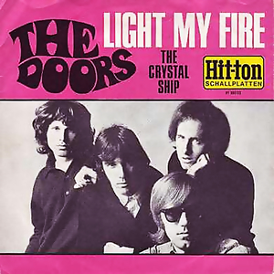
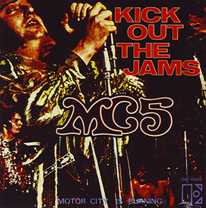
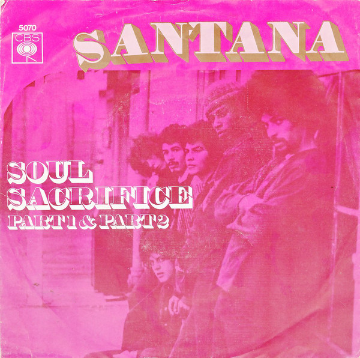
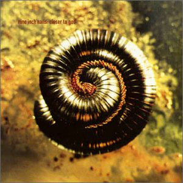

50 Greatest Songs From '54 to '04
=================================

 

Release dates denote when the song was first published, either as a single
or as a part of an album. Image shows the cover of the single or the label if no
edition of the single had a cover. If song was never released as a single,
then the cover of the first album that featured the song is used. Songs with
multiple versions have the preferred version listed first in the <i>lengths</i>
field.
 
 
<b>Click on the cover to listen to the song on YouTube!!!</b> 
<b>YouTube <a target="_blank" href="https://www.youtube.com/watch?v=SDtVAM80zbg&t=0s&index=1&list=PLaeyhQtn9sJyEbOQ9Ouo9e8VdMBgA7nt1">playlist</a> is also available.</b>
  

### '54 Oct | "Mr. Sandman" — The Chordettes  

**Genres:&ensp;Barbershop Music, Traditional Pop**  
**Writer:&ensp;Pat Ballard**  
**Producer:&ensp;Archie Bleyer**  
**Length:&ensp;2:22**  
**Label:&ensp;Cadence**  

### '55 Dec | "Folsom Prison Blues" — Johnny Cash  

**Genres:&ensp;Rockabilly, Rock And Roll**  
**Writer:&ensp;Johnny Cash**  
**Producer:&ensp;Sam Phillips**  
**Length:&ensp;2:50**  
**Label:&ensp;Sun**  

### '58 Apr | "Rumble" — Link Wray & His Ray Men  

**Genres:&ensp;Rock And Roll, Surf Rock**  
**Writers:&ensp;Milt Grant, Link Wray**  
**Length:&ensp;2:25**  
**Label:&ensp;Cadence 1347**  
   

### '62 Apr | "Miserlou" — Dick Dale  

**Genres:&ensp;Instrumental Rock, Surf Rock**  
**Writers:&ensp;Nick Roubanis, Fred Wise, Milton Leeds, Bob Russell**  
**Length:&ensp;2:15**  
**Label:&ensp;Deltone Records**  
   

### '64 Mar | "The Girl from Ipanema" — Stan Getz and João Gilberto  

**Genres:&ensp;Bossa Nova, Jazz**  
**Writers:&ensp;Antônio Carlos Jobim & Vinicius De Moraes, Norman Gimbel (English Lyrics)**  
**Producer:&ensp;Creed Taylor**  
**Length:&ensp;5:21 (Album Version), 2:44 (Single Version)**  
**Label:&ensp;Verve**  

### '64 Aug | "You Really Got Me" — the Kinks  

**Genres:&ensp;Hard Rock, Garage Rock**  
**Writer:&ensp;Ray Davies**  
**Producer:&ensp;Shel Talmy**  
**Length:&ensp;2:20**  
**Labels:&ensp;Pye (Uk), Reprise (Us)**  

### '65 Jun | "(I Can't Get No) Satisfaction" — The Rolling Stones  

**Genres:&ensp;Rock, Hard Rock**  
**Writer:&ensp;Jagger/Richards**  
**Producer:&ensp;Andrew Loog Oldham**  
**Length:&ensp;3:45**  
**Labels:&ensp;London (Us), Decca (Uk)**  

### '65 Jul | "Help!" — the Beatles  

**Genre:&ensp;Folk Rock**  
**Writer:&ensp;Lennon–Mccartney**  
**Producer:&ensp;George Martin**  
**Length:&ensp;2:18**  
**Labels:&ensp;Capitol (Us), Parlophone (Uk)**  

### '65 Dec | "California Dreamin'" — The Mamas & the Papas  

**Genres:&ensp;Sunshine Pop, Folk Rock**  
**Writers:&ensp;John Phillips, Michelle Phillips**  
**Producer:&ensp;Lou Adler**  
**Length:&ensp;2:38**  
**Label:&ensp;Dunhill Records**  

### '66 Aug | "Tomorrow Never Knows" — the Beatles  

**Genres:&ensp;Psychedelic Rock, Raga Rock, Hard Rock, Avant-Pop**  
**Writer:&ensp;Lennon–Mccartney**  
**Producer:&ensp;George Martin**  
**Length:&ensp;2:58**  
**Label:&ensp;Parlophone**  

### '66 Dec | "The Ecstasy of Gold" — Ennio Morricone  

**Genres:&ensp;Film Score, Western**  
**Writer:&ensp;Ennio Morricone**  
**Producer:&ensp;Ennio Morricone**  
**Length:&ensp;3:22**  
**Labels:&ensp;Emi America, Capitol Records**  

### '67 Jan | "Light My Fire" — The Doors  

**Genre:&ensp;Psychedelic Rock**  
**Writers:&ensp;Jim Morrison, Robbie Krieger, John Densmore, Ray Manzarek**  
**Producer:&ensp;Paul A. Rothchild**  
**Lengths:&ensp;7:06 (Album Version), 2:52 (Single Version)**  
**Label:&ensp;Elektra**  

### '67 Feb | "White Rabbit" — Jefferson Airplane  

**Genre:&ensp;Psychedelic Rock**  
**Writer:&ensp;Grace Slick**  
**Producer:&ensp;Rick Jarrard**  
**Length:&ensp;2:31**  
**Label:&ensp;Rca Victor**  

### '67 Mar | "Venus in Furs" — the Velvet Underground  

**Genres:&ensp;Garage Rock, Avantgarde**  
**Writer:&ensp;Lou Reed**  
**Producer:&ensp;Andy Warhol**  
**Length:&ensp;5:12**  
**Label:&ensp;Verve**  

### '67 Dec | "If 6 Was 9" — the Jimi Hendrix Experience  

**Genre:&ensp;Rock**  
**Writer:&ensp;Jimi Hendrix**  
**Producer:&ensp;Chas Chandler**  
**Length:&ensp;5:32**  
**Labels:&ensp;Track (Uk), Reprise (Us)**  

### '68 Jul | "Five to One" — The Doors  

**Genres:&ensp;Psychedelic Rock, Hard Rock, Blues Rock**  
**Writer:&ensp;Jim Morrison**  
**Producer:&ensp;Paul A. Rothchild**  
**Length:&ensp;4:24**  
**Label:&ensp;Elektra**  

### '68 Oct | "With a Little Help from My Friends" — Joe Cocker  

**Genres:&ensp;Blues Rock, Hard Rock, Soul**  
**Writer:&ensp;Lennon–Mccartney**  
**Producer:&ensp;Denny Cordell**  
**Length:&ensp;5:11**  
**Label:&ensp;Regal Zonophone**  

### '69 Feb | "Kick Out the Jams" — MC5  

**Genres:&ensp;Garage Rock, Proto-Punk, Hard Rock**  
**Writers:&ensp;Michael Davis, Wayne Kramer, Fred "Sonic" Smith, Dennis Thompson, Rob Tyner**  
**Producers:&ensp;Bruce Botnick, Jac Holzman**  
**Length:&ensp;2:37**  
**Label:&ensp;Elektra**  

### '69 Mar | "Pale Blue Eyes" — The Velvet Underground  

**Genres:&ensp;Folk Rock, Country, Pop**  
**Writer:&ensp;Lou Reed**  
**Producer:&ensp;The Velvet Underground**  
**Length:&ensp;5:40**  
**Label:&ensp;Mgm**  

### '69 Jul | "The Soft Parade" — The Doors  

**Genres:&ensp;Psychedelic Rock, Progressive Rock, Blues Rock**  
**Writer:&ensp;Jim Morrison**  
**Producer:&ensp;Paul A. Rothchild**  
**Length:&ensp;10:09 (Box Set, '69 Apr / '97 Oct), 8:34 (9:41 on remastered album)**  
**Label:&ensp;Elektra**  

### '69 Aug | "Soul Sacrifice" — Santana  

**Genres:&ensp;Latin Rock, Blues Rock**  
**Writers:&ensp;David Brown, Marcus Malone, Gregg Rolie, Carlos Santana**  
**Producers:&ensp;Brent Dangerfield, Santana**  
**Length:&ensp;8:05 (Woodstock Version '69 Aug / '70 May), 6:37 (Album Version)**  
**Label:&ensp;Columbia**  

### '69 Oct | "21st Century Schizoid Man" — King Crimson  

**Genres:&ensp;Progressive Rock, Jazz-Rock, Heavy Metal, Progressive Metal**  
**Writers:&ensp;Robert Fripp, Michael Giles, Greg Lake, Ian Mcdonald, Peter Sinfield**  
**Producer:&ensp;King Crimson**  
**Length:&ensp;6:45 (Live in Mexico City, '96 / '99), 7:20 (Album Version)**  
**Label:&ensp;Island**  

### '70 Jul | "Celebration of the Lizard" — The Doors  

**Genres:&ensp;Psychedelic Rock, Acid Rock, Space Rock, Progressive Rock, Poetry**  
**Writers:&ensp;John Densmore, Robbie Kreiger, Ray Manzarek, Jim Morrison**  
**Producer:&ensp;Paul A. Rothchild**  
**Length:&ensp;17:18 (Live In New York, '70 Jan/'97), 14:25 (Absolutely Live), 17:09 (Studio Version, '68/'03)**  
**Label:&ensp;Elektra**  

### '72 Nov | "Walk on the Wild Side" — Lou Reed  

**Writer:&ensp;Lou Reed**  
**Producers:&ensp;David Bowie, Mick Ronson**  
**Length:&ensp;4:12**  
**Label:&ensp;Rca Records**  
   

### '76 Feb | "Blitzkrieg Bop" — Ramones  

**Genre:&ensp;Punk Rock**  
**Writers:&ensp;Tommy Ramone, Dee Dee Ramone**  
**Producer:&ensp;Craig Leon**  
**Length:&ensp;2:12**  
**Label:&ensp;Sire/Abc**  

### '77 Feb | "Marquee Moon" — Television  

**Genre:&ensp;Post-Punk**  
**Writer:&ensp;Tom Verlaine**  
**Producers:&ensp;Andy Johns, Tom Verlaine**  
**Length:&ensp;10:40 (Re-issue without fadeout, Rel. '89), 9:58**  
**Label:&ensp;Elektra**  

### '77 Aug | "Lust for Life" — Iggy Pop  

**Genres:&ensp;Garage Rock, Punk Rock**  
**Writers:&ensp;Iggy Pop, David Bowie**  
**Producer:&ensp;David Bowie**  
**Length:&ensp;5:12**  
**Label:&ensp;Rca**  

### '77 Sep | "Psycho Killer" — Talking Heads  

**Genres:&ensp;New Wave, No Wave, Art Pop**  
**Writers:&ensp;David Byrne, Chris Frantz, Tina Weymouth**  
**Producers:&ensp;Tony Bongiovi, Lance Quinn**  
**Length:&ensp;4:19**  
**Label:&ensp;Sire**  

### '78 Sep | "Blue Valentines" — Tom Waits  

**Writer:&ensp;Tom Waits**  
**Producer:&ensp;Bones Howe**  
**Length:&ensp;5:49**  
**Label:&ensp;Asylum**  
   

### '79 Jun | "California Über Alles" — Dead Kennedys  

**Genre:&ensp;Punk Rock**  
**Writer:&ensp;Jello Biafra & John Greenway**  
**Producer:&ensp;Dead Kennedys**  
**Length:&ensp;3:26 (Single Version), 3:03 (Album Version, Rel. '80 Sep, re-recorded)**  
**Labels:&ensp;Alternative Tentacles (Us), Fast Product (Uk)**  

### '79 Sep | "Rapper's Delight" — The Sugarhill Gang  

**Genres:&ensp;Old-School Hip Hop, Disco, Funk**  
**Writers:&ensp;The Sugarhill Gang, Sylvia Robinson, Nile Rodgers, Bernard Edwards, Grandmaster Caz**  
**Producer:&ensp;Sylvia Robinson**  
**Length:&ensp;14:35 (Album Version), 6:30 (12" Short Version), 3:55 (Single Version)**  
**Label:&ensp;Sugar Hill**  

### '79 Oct | "Transmission" — Joy Division  

**Genre:&ensp;Post-Punk**  
**Writers:&ensp;Ian Curtis, Peter Hook, Stephen Morris, Bernard Sumner**  
**Producer:&ensp;Martin Hannett**  
**Length:&ensp;3:38**  
**Label:&ensp;Factory**  

### '79 Dec | "London Calling" — the Clash  

**Genre:&ensp;Post-Punk**  
**Writer:&ensp;Joe Strummer And Mick Jones**  
**Producer:&ensp;Guy Stevens**  
**Length:&ensp;3:18**  
**Label:&ensp;Cbs 8087**  

### '80 Sep | "In Shades" — Tom Waits  

**Genre:&ensp;Blues Rock**  
**Writer:&ensp;Tom Waits**  
**Producer:&ensp;Bones Howe**  
**Length:&ensp;4:25**  
**Label:&ensp;Asylum**  

### '81  | "Tovar'ši, jest vam ne verjamem" — Pankrti  

**Genre:&ensp;Punk Rock**  
**Writer:&ensp;Pankrti**  
**Producers:&ensp;Igor Vidmar, Pankrti**  
**Length:&ensp;1:45**  
**Label:&ensp;Rtv Ljubljana**  

### '83 Apr | "Blister in the Sun" — Violent Femmes  

**Genres:&ensp;Folk Punk, Anti-Folk, Alternative Rock, Progressive Folk**  
**Writer:&ensp;Gordon Gano**  
**Producer:&ensp;Mark Van Hecke**  
**Length:&ensp;2:27**  
**Label:&ensp;Slash**  

### '83 Oct | "This Charming Man" — The Smiths  

**Genres:&ensp;Jangle Pop, Pop Rock**  
**Writers:&ensp;Johnny Marr, Morrissey**  
**Producers:&ensp;Roger Pusey (Peel Version), John Porter (Single Version)**  
**Length:&ensp;2:41**  
**Label:&ensp;Rough Trade**  

### '86 Oct | "Raining Blood" — Slayer  

**Genre:&ensp;Thrash Metal**  
**Writers:&ensp;Jeff Hanneman, Kerry King**  
**Producers:&ensp;Rick Rubin, Slayer**  
**Length:&ensp;4:14**  
**Label:&ensp;Def Jam**  

### '88  | "Bosna moja" — Safet Isović  

**Genres:&ensp;Folk, Sevdah**  
**Writers:&ensp;R. Živković, Z. Jovanović, Omer Pobrić**  
**Producer:&ensp;Omer Pobrić**  
**Length:&ensp;5:34**  
**Label:&ensp;Diskoton**  

### '89 Apr | "Hey" — Pixies  

**Genres:&ensp;Alternative Rock, Noise Pop**  
**Writer:&ensp;Black Francis**  
**Producer:&ensp;Gil Norton**  
**Length:&ensp;3:31**  
**Labels:&ensp;4Ad, Elektra (Initial U.S. Distribution)**  

### '91 Sep | "In Bloom" — Nirvana  

**Genre:&ensp;Grunge**  
**Writer:&ensp;Kurt Cobain**  
**Producer:&ensp;Butch Vig**  
**Length:&ensp;4:11**  
**Label:&ensp;Dgc**  

### '93 Mar | "Loser" — Beck  

**Genres:&ensp;Alternative Rock, Hip Hop**  
**Writers:&ensp;Beck, Karl Stephenson**  
**Producers:&ensp;Beck, Karl Stephenson, Tom Rothrock**  
**Length:&ensp;3:55**  
**Labels:&ensp;Bong Load Custom, Dgc**  

### '94 Mar | "Closer" — Nine Inch Nails  

**Genre:&ensp;Industrial Rock**  
**Writer:&ensp;Trent Reznor**  
**Producers:&ensp;Flood, Trent Reznor**  
**Length:&ensp;6:13**  
**Labels:&ensp;Nothing, Tvt, Interscope, Atlantic**  

### '96 Apr | "Mother North" — Satyricon  

**Genre:&ensp;Black Metal**  
**Writer:&ensp;Satyr**  
**Producer:&ensp;Satyr**  
**Length:&ensp;6:26**  
**Labels:&ensp;Moonfog, Century Media**  

### '97 Feb | "Song 2" — Blur  

**Genres:&ensp;Alternative Rock, Punk Rock**  
**Writers:&ensp;Damon Albarn, Graham Coxon, Alex James, Dave Rowntree**  
**Producer:&ensp;Stephen Street**  
**Length:&ensp;2:02**  
**Label:&ensp;Food**  

### '97 Jun | "Smack My Bitch Up" — The Prodigy  

**Genres:&ensp;Big Beat, Techno**  
**Writers:&ensp;Liam Howlett, Cedric Miller, Trevor Randolph, Maurice Smith, Keith Thornton**  
**Producer:&ensp;Liam Howlett**  
**Length:&ensp;4:45 (Edit), 5:43 (Album Version)**  
**Labels:&ensp;Xl, Maverick, Sony**  

### '01 Aug | "Superstylin'" — Groove Armada  

**Genres:&ensp;House, Reggae Fusion, Speed Garage**  
**Writers:&ensp;Andy Cato, Jonathan White, Michael Anthony Daniel, Tom Findlay**  
**Producer:&ensp;Groove Armada**  
**Length:&ensp;6:02 (Album Version), 3:43 (Edited Version)**  
**Label:&ensp;Zomba**  

### '02 Nov | "Hurt" — Johnny Cash  

**Genres:&ensp;Alternative Rock, Acoustic Rock, Country**  
**Writer:&ensp;Trent Reznor**  
**Producer:&ensp;Rick Rubin**  
**Length:&ensp;3:38**  
**Labels:&ensp;American, Lost Highway**  

### '04 Jan | "Yeah" — LCD Soundsystem  

**Genres:&ensp;Dance-Punk, Indietronica, Electroclash, Acid House**  
**Writers:&ensp;Tim Goldsworthy, James Murphy**  
**Producer:&ensp;The Dfa**  
**Length:&ensp;9:20 (Crass Version), 11:03 (Pretentious Version)**  
**Label:&ensp;Dfa**  

### '04 Mar | "Linzserenade" — Gustav  

**Writer:&ensp;Eva Jantschitsch**  
**Producer:&ensp;Eva Jantschitsch**  
**Length:&ensp;4:12**  
**Label:&ensp;Mosz**  
   

Origin
------

Release Date — Year
------

Release Date — Month
------

Key
------

Tempo
------
