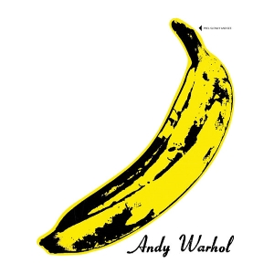
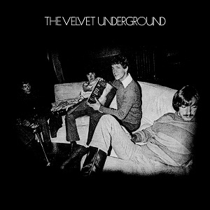
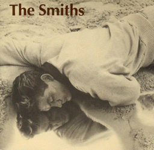
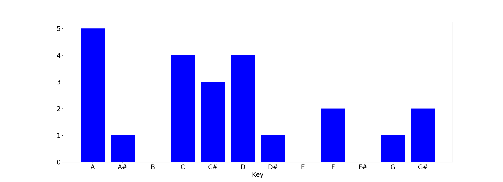

50 Greatest Songs From '54 to '04
=================================

 

Release dates denote when the song was first published, either as a single 
or as a part of an album. Image shows the cover of the single or the label if no
 edition of the single had a cover. If song was never released as a single, 
 then the cover of the first album that featured the song is used. 
 
<b>Click on the cover to listen to the song on Youtube!!!</b>
  

### '54 Oct | "Mr. Sandman" — The Chordettes  

**Genres:&ensp;Barbershop Music, Traditional Pop**  
**Writer:&ensp;Pat Ballard**  
**Producer:&ensp;Archie Bleyer**  
**Length:&ensp;2:22**  
**Label:&ensp;Cadence**  

### '55 Dec | "Folsom Prison Blues" — Johnny Cash  

**Genres:&ensp;Rockabilly, Rock And Roll**  
**Writer:&ensp;Johnny Cash**  
**Producer:&ensp;Sam Phillips**  
**Length:&ensp;2:50**  
**Label:&ensp;Sun**  

### '56 Jan | "Heartbreak Hotel" — Elvis Presley  

**Genres:&ensp;Blues, Rockabilly, Rock And Roll**  
**Writers:&ensp;Mae Boren Axton, Thomas Durden, Elvis Presley**  
**Producer:&ensp;Steve Sholes**  
**Length:&ensp;2:08**  
**Label:&ensp;Rca Victor**  

### '57 Nov | "Great Balls of Fire" — Jerry Lee Lewis  

**Genres:&ensp;Rock And Roll, Rockabilly, Country**  
**Writers:&ensp;Otis Blackwell, Jack Hammer**  
**Producer:&ensp;Sam Phillips**  
**Length:&ensp;1:52**  
**Label:&ensp;Sun**  

### '58 Apr | "Rumble" — Link Wray & His Ray Men  

**Genres:&ensp;Rock And Roll, Surf Rock**  
**Writers:&ensp;Milt Grant, Link Wray**  
**Length:&ensp;2:25**  
**Label:&ensp;Cadence**  
   

### '62 Apr | "Miserlou" — Dick Dale  

**Genres:&ensp;Instrumental Rock, Surf Rock**  
**Writers:&ensp;Nick Roubanis, Fred Wise, Milton Leeds, Bob Russell**  
**Length:&ensp;2:15**  
**Label:&ensp;Deltone Records**  
   

### '63  | "The Girl from Ipanema" — Stan Getz and João Gilberto  

**Genres:&ensp;Bossa Nova, Jazz**  
**Writers:&ensp;Antônio Carlos Jobim & Vinicius De Moraes, Norman Gimbel (English Lyrics)**  
**Producer:&ensp;Creed Taylor**  
**Length:&ensp;2:44, 5:21**  
**Label:&ensp;Verve**  

### '64 Aug | "You Really Got Me" — the Kinks  

**Genres:&ensp;Hard Rock, Garage Rock**  
**Writer:&ensp;Ray Davies**  
**Producer:&ensp;Shel Talmy**  
**Length:&ensp;2:20**  
**Labels:&ensp;Pye (Uk), Reprise (Us)**  

### '65 Mar | "Subterranean Homesick Blues" — Bob Dylan  

**Genres:&ensp;Folk Rock, Blues Rock, Rock And Roll**  
**Writer:&ensp;Bob Dylan**  
**Producer:&ensp;Tom Wilson**  
**Length:&ensp;2:20**  
**Label:&ensp;Columbia**  

### '65 Jun | "(I Can't Get No) Satisfaction" — The Rolling Stones  

**Genres:&ensp;Rock, Hard Rock**  
**Writer:&ensp;Jagger/Richards**  
**Producer:&ensp;Andrew Loog Oldham**  
**Length:&ensp;3:45**  
**Labels:&ensp;London, Decca**  

### '65 Jul | "Help!" — the Beatles  

**Genre:&ensp;Folk Rock**  
**Writer:&ensp;Lennon–Mccartney**  
**Producer:&ensp;George Martin**  
**Length:&ensp;2:18**  
**Labels:&ensp;Parlophone, Capitol**  

### '65 Dec | "California Dreamin'" — The Mamas & the Papas  

**Genres:&ensp;Sunshine Pop, Folk Rock**  
**Writers:&ensp;John Phillips, Michelle Phillips**  
**Producer:&ensp;Lou Adler**  
**Length:&ensp;2:38**  
**Label:&ensp;Dunhill Records**  

### '66 Aug | "Tomorrow Never Knows" — the Beatles  

**Genres:&ensp;Psychedelic Rock, Raga Rock, Hard Rock, Avant-Pop**  
**Writer:&ensp;Lennon–Mccartney**  
**Producer:&ensp;George Martin**  
**Length:&ensp;2:58**  
**Label:&ensp;Parlophone**  

### '67 Jan | "Break On Through (To the Other Side)" — The Doors  

**Genre:&ensp;Psychedelic Rock**  
**Writers:&ensp;Jim Morrison, Ray Manzarek, John Densmore, Robby Krieger**  
**Producer:&ensp;Paul A. Rothchild**  
**Length:&ensp;2:26**  
**Label:&ensp;Elektra**  

### '67 Jan | "Light My Fire" — The Doors  

**Genre:&ensp;Psychedelic Rock**  
**Writers:&ensp;Jim Morrison, Robbie Krieger, John Densmore, Ray Manzarek**  
**Producer:&ensp;Paul A. Rothchild**  
**Lengths:&ensp;7:06 (Album Version), 2:52 (Single Version)**  
**Label:&ensp;Elektra**  

### '67 Feb | "White Rabbit" — Jefferson Airplane  

**Genre:&ensp;Psychedelic Rock**  
**Writer:&ensp;Grace Slick**  
**Producer:&ensp;Rick Jarrard**  
**Length:&ensp;2:31**  
**Label:&ensp;Rca Victor**  

### '67 Mar | "Venus in Furs" — the Velvet Underground  

**Genres:&ensp;Garage Rock, Avantgarde**  
**Writer:&ensp;Lou Reed**  
**Producer:&ensp;Andy Warhol**  
**Length:&ensp;5:12**  
**Label:&ensp;Verve**  

### '67 Dec | "If 6 Was 9" — the Jimi Hendrix Experience  

**Genre:&ensp;Rock**  
**Writer:&ensp;Jimi Hendrix**  
**Producer:&ensp;Chas Chandler**  
**Length:&ensp;5:32**  
**Labels:&ensp;Track (Uk), Reprise (Us)**  

### '68 Jul | "Five to One" — The Doors  

**Genres:&ensp;Psychedelic Rock, Hard Rock, Blues Rock**  
**Writer:&ensp;Jim Morrison**  
**Producer:&ensp;Paul A. Rothchild**  
**Length:&ensp;4:24**  
**Label:&ensp;Elektra**  

### '69 Mar | "The Murder Mystery" — the Velvet Underground  

**Producer:&ensp;The Velvet Underground**  
**Length:&ensp;8:55**  
**Label:&ensp;Mgm**  
   
   

### '70 Jul | "Celebration of the Lizard" — The Doors  

**Genres:&ensp;Psychedelic Rock, Acid Rock, Space Rock, Progressive Rock, Poetry**  
**Writers:&ensp;John Densmore, Robbie Kreiger, Ray Manzarek, Jim Morrison**  
**Producer:&ensp;Paul A. Rothchild**  
**Length:&ensp;14:25 (Live Version), 17:09 (Studio Version)**  
**Label:&ensp;Elektra**  

### '72 Nov | "Walk on the Wild Side" — Lou Reed  

**Writer:&ensp;Lou Reed**  
**Producers:&ensp;David Bowie, Mick Ronson**  
**Length:&ensp;4:12**  
**Label:&ensp;Rca Records**  
   

### '74 Mar | "Top" — Bijelo Dugme  

**Genres:&ensp;Blues Rock, Classic Rock**  
**Writer:&ensp;Goran Bregović**  
**Producer:&ensp;Nikola Borota**  
**Length:&ensp;4:12**  
**Label:&ensp;Jugoton**  

### '76 Feb | "Blitzkrieg Bop" — Ramones  

**Genre:&ensp;Punk Rock**  
**Writers:&ensp;Tommy Ramone, Dee Dee Ramone**  
**Producer:&ensp;Craig Leon**  
**Length:&ensp;2:12**  
**Label:&ensp;Sire/Abc**  

### '76 Jun | "Zombie" — Fela Kuti  

**Genre:&ensp;Afrobeat**  
**Producer:&ensp;Fela Kuti**  
**Length:&ensp;12:26**  
**Label:&ensp;Coconut**  
   

### '77 Feb | "Marquee Moon" — Television  

**Genre:&ensp;Post-Punk**  
**Writer:&ensp;Tom Verlaine**  
**Producers:&ensp;Andy Johns, Tom Verlaine**  
**Length:&ensp;9:58, 10:40 (Re-Issue)**  
**Label:&ensp;Elektra**  

### '77 Aug | "Lust for Life" — Iggy Pop  

**Genres:&ensp;Garage Rock, Punk Rock**  
**Writers:&ensp;Iggy Pop, David Bowie**  
**Producer:&ensp;David Bowie**  
**Length:&ensp;5:12**  
**Label:&ensp;Rca**  

### '77 Sep | "Psycho Killer" — Talking Heads  

**Genres:&ensp;New Wave, No Wave, Art Pop**  
**Writers:&ensp;David Byrne, Chris Frantz, Tina Weymouth**  
**Producers:&ensp;Tony Bongiovi, Lance Quinn**  
**Length:&ensp;4:19**  
**Label:&ensp;Sire**  

### '79 Sep | "Rapper's Delight" — The Sugarhill Gang  

**Genres:&ensp;Old-School Hip Hop, Disco, Funk**  
**Writers:&ensp;The Sugarhill Gang, Sylvia Robinson, Nile Rodgers, Bernard Edwards, Grandmaster Caz**  
**Producer:&ensp;Sylvia Robinson**  
**Length:&ensp;3:55 (Single Version), 6:30 (12" Short Version), 14:35 (Album Version)**  
**Label:&ensp;Sugar Hill**  

### '79 Oct | "Transmission" — Joy Division  

**Genre:&ensp;Post-Punk**  
**Writers:&ensp;Ian Curtis, Peter Hook, Stephen Morris, Bernard Sumner**  
**Producer:&ensp;Martin Hannett**  
**Length:&ensp;3:38**  
**Label:&ensp;Factory**  

### '79 Dec | "London Calling" — the Clash  

**Genre:&ensp;Post-Punk**  
**Writer:&ensp;Joe Strummer And Mick Jones**  
**Producer:&ensp;Guy Stevens**  
**Length:&ensp;3:18**  
**Label:&ensp;Cbs**  

### '80 Feb | "Sedemnajst" — Pankrti  

**Genre:&ensp;Punk Rock**  
**Writers:&ensp;Gregor Tomc, Dušan Žiberna**  
**Producer:&ensp;Igor Vidmar**  
**Length:&ensp;1:24**  
**Label:&ensp;Rtv Ljubljana**  

### '80 Sep | "In Shades" — Tom Waits  

**Genre:&ensp;Blues Rock**  
**Writer:&ensp;Tom Waits**  
**Producer:&ensp;Bones Howe**  
**Length:&ensp;4:25**  
**Label:&ensp;Asylum**  

### '81  | "Tovar'ši, jest vam ne verjamem" — Pankrti  

**Genre:&ensp;Punk Rock**  
**Writer:&ensp;Pankrti**  
**Producers:&ensp;Igor Vidmar, Pankrti**  
**Length:&ensp;1:45**  
**Label:&ensp;Rtv Ljubljana**  

### '83 Mar | "Blue Monday" — New Order  

**Genres:&ensp;Synth-Pop, Alternative Dance, Hi-Nrg**  
**Writers:&ensp;Gillian Gilbert, Peter Hook, Stephen Morris, Bernard Sumner**  
**Producer:&ensp;New Order**  
**Length:&ensp;7:29, 4:09 (Edited Version)**  
**Labels:&ensp;Factory**  

### '83 Apr | "Add It Up" — Violent Femmes  

**Genres:&ensp;Alternative Rock, Folk Punk, Post-Punk**  
**Writer:&ensp;Gordon Gano**  
**Producer:&ensp;Mark Van Hecke**  
**Length:&ensp;4:44**  
**Label:&ensp;Slash**  

### '83 Apr | "Blister in the Sun" — Violent Femmes  

**Genres:&ensp;Folk Punk, Anti-Folk, Alternative Rock, Progressive Folk**  
**Writer:&ensp;Gordon Gano**  
**Producer:&ensp;Mark Van Hecke**  
**Length:&ensp;2:27**  
**Label:&ensp;Slash**  

### '83 Oct | "This Charming Man" — The Smiths  

**Genres:&ensp;Jangle Pop, Pop Rock**  
**Writers:&ensp;Johnny Marr, Morrissey**  
**Producers:&ensp;Roger Pusey (Peel Version), John Porter (Single Version)**  
**Length:&ensp;2:41**  
**Label:&ensp;Rough Trade**  

### '86 Feb | "Kiss" — Prince and The Revolution  

**Genres:&ensp;Post-Disco, Funk**  
**Writer:&ensp;Prince**  
**Producer:&ensp;Prince**  
**Length:&ensp;3:38 (Lp Version) ,  3:46 (7" Single) ,  7:16 (12" Single)**  
**Label:&ensp;Paisley Park / Warner Bros.**  

### '88  | "Bosna moja" — Safet Isović  

**Genres:&ensp;Folk, Sevdah**  
**Writers:&ensp;R. Živković, Z. Jovanović, Omer Pobrić**  
**Producer:&ensp;Omer Pobrić**  
**Length:&ensp;5:34**  
**Label:&ensp;Diskoton**  

### '91 Sep | "In Bloom" — Nirvana  

**Genre:&ensp;Grunge**  
**Writer:&ensp;Kurt Cobain**  
**Producer:&ensp;Butch Vig**  
**Length:&ensp;4:11**  
**Label:&ensp;Dgc**  

### '93 Mar | "Loser" — Beck  

**Genres:&ensp;Alternative Rock, Hip Hop**  
**Writers:&ensp;Beck, Karl Stephenson**  
**Producers:&ensp;Beck, Karl Stephenson, Tom Rothrock**  
**Length:&ensp;3:55**  
**Labels:&ensp;Bong Load Custom, Dgc**  

### '96 Apr | "Mother North" — Satyricon  

**Genre:&ensp;Black Metal**  
**Writer:&ensp;Satyr**  
**Producer:&ensp;Satyr**  
**Length:&ensp;6:26**  
**Labels:&ensp;Moonfog, Century Media**  

### '97 Feb | "Song 2" — Blur  

**Genres:&ensp;Alternative Rock, Punk Rock**  
**Writers:&ensp;Damon Albarn, Graham Coxon, Alex James, Dave Rowntree**  
**Producer:&ensp;Stephen Street**  
**Length:&ensp;2:02**  
**Label:&ensp;Food**  

### '00 May | "When the Curious Girl Realizes She Is Under Glass" — Bright Eyes  

**Genres:&ensp;Indie Rock, Indie Folk, Emo**  
**Producer:&ensp;Mike Mogis**  
**Length:&ensp;2:40**  
**Labels:&ensp;Saddle Creek (Us), , Wichita Recordings (Uk)**  
   

### '00 Aug | "One Armed Scissor" — At the Drive-In  

**Genres:&ensp;Post-Hardcore, Progressive Rock, Experimental Rock, Math Rock**  
**Writer:&ensp;At The Drive-In**  
**Producer:&ensp;Ross Robinson**  
**Length:&ensp;3:45**  
**Label:&ensp;Grand Royal**  

### '01 Aug | "Superstylin'" — Groove Armada  

**Genres:&ensp;House, Reggae Fusion, Speed Garage**  
**Writers:&ensp;Andy Cato, Jonathan White, Michael Anthony Daniel, Tom Findlay**  
**Producer:&ensp;Groove Armada**  
**Length:&ensp;3:43 (Edited Version), 6:02 (Album Version)**  
**Label:&ensp;Zomba**  

### '02 Nov | "Hurt" — Johnny Cash  

**Genres:&ensp;Alternative Rock, Acoustic Rock, Country**  
**Writer:&ensp;Trent Reznor**  
**Producer:&ensp;Rick Rubin**  
**Length:&ensp;3:38**  
**Labels:&ensp;American, Lost Highway**  

### '04 Jan | "Yeah" — LCD Soundsystem  

**Genres:&ensp;Dance-Punk, Indietronica, Electroclash, Acid House**  
**Writers:&ensp;Tim Goldsworthy, James Murphy**  
**Producer:&ensp;The Dfa**  
**Lengths:&ensp;9:20 (Crass Version), 11:03 (Pretentious Version)**  
**Label:&ensp;Dfa**  

### '04 Mar | "Linzserenade" — Gustav  

**Producer:&ensp;Eva Jantschitsch**  
**Length:&ensp;4:12**  
**Label:&ensp;Mosz**  
   
   

Origin
------

Release Date — Year
------

Release Date — Month
------

Key
------

Tempo
------
